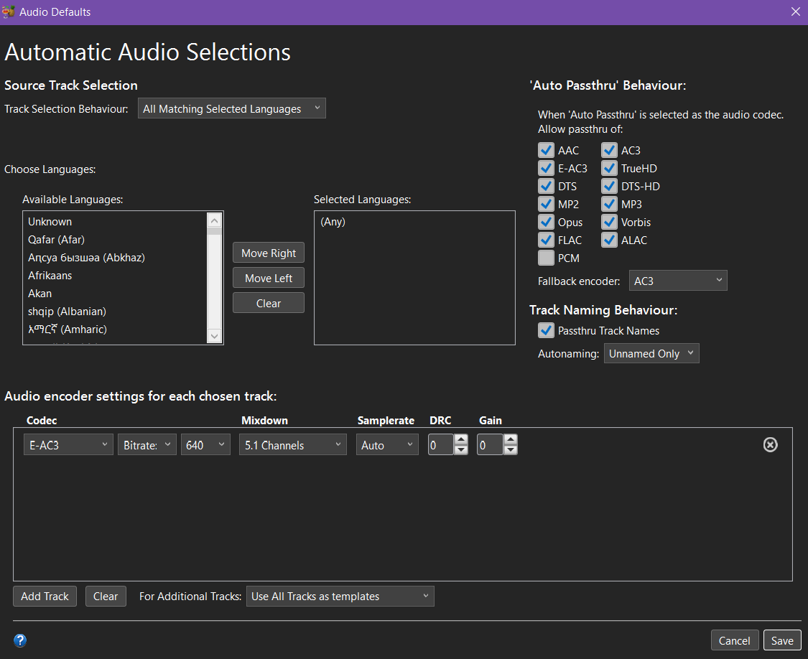
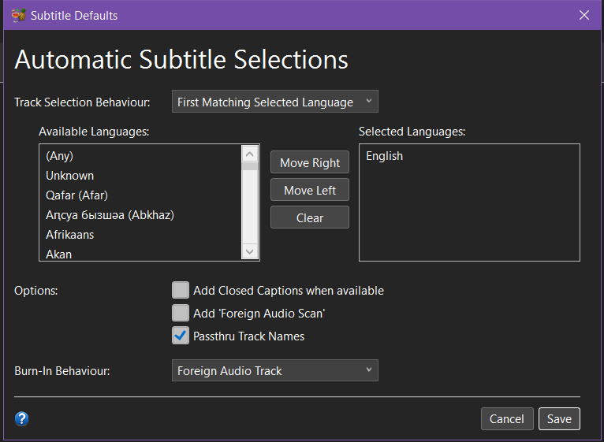

# HandBrake Compression
This is very much an optional step, but one that I would highly recommend if you are looking to save space on your NAS or want to do something like I do with a Tailscale VPN for access. I'm going to walk through the presets I have set up that work for me, but if you are unsure, Handbrake does have native presets that work just fine. These are suggestions and are constantly tweaked, so find what works best for you and your setup. I tend to overcompress to maximize space.

## Preset Suggestions
1. **Video**
    * **DVD**
        * **Video Encoder**: H.265 10-bit (x.265)
        * **Framerate (FPS)**: Same as source
        * **Color Range**: Same as source
        * **Quality**: 20 RF
    * **Blu-Ray**
        * **Video Encoder**: H.265 10-bit (x.265)
        * **Framerate (FPS)**: Same as source
        * **Color Range**: Same as source
        * **Quality**: 21 RF
    * **4k**
        * **Video Encoder**: H.265 10-bit (x.265)
        * **Framerate (FPS)**: Same as source
        * **Color Range**: Same as source
        * **Quality**: 24 RF
2. **Audio**
    * **DVD**
        * 
        *Selection Behavior*
    * **Blu-Ray**
        * 
        *Selection Behavior*
    * **4k**
        * 
        *Selection Behavior*
3. **Subtitles**
    * **DVD**
        * 
        *Selection Behavior*
        * If you have only foreign audio or will always watch with subtitles, I recommend checking the "Burn In" box.
    * **Blu-Ray**
        * 
        *Selection Behavior*
        * If you have only foreign audio or will always watch with subtitles, I recommend checking the "Burn In" box.
    * **4k**
        * 
        *Selection Behavior*
        * If you have only foreign audio or will always watch with subtitles, I recommend checking the "Burn In" box.

## Workflow
1. **Source:** Load file from MakeMKV rip folder.
2. **Preset:** Select your preset based on what type of file you're compressing.
3. **Queue:** Add to queue and output to "Staging" folder (I just do it into the generic Videos directory so I can either move to existing folder on local machine to override the MakeMKV rip file or existing folder on NAS).