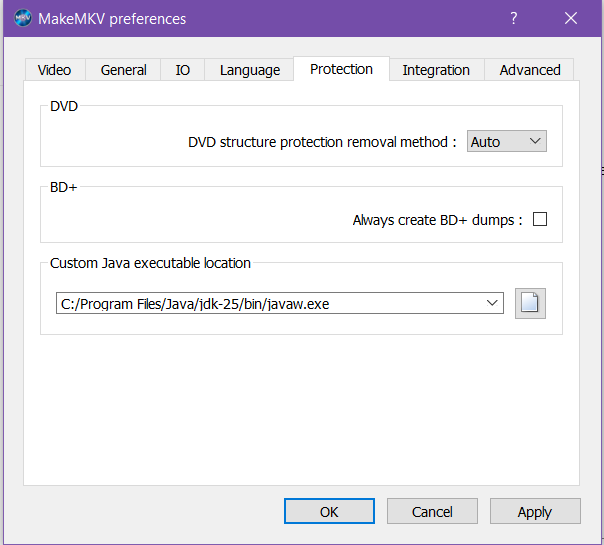

# Ripping Workflow: MakeMKV
I use MakeMKV to create a .mkv containter of the film or show I'm wanting. I just rip the select file and subtitles I'm looking while stripping out the extra files or options on the main file, but if you want the extras on the disc this will work for that too. The instructions below are written for someone using Windows or Fedora UI on a separate machine from the machine running Emby, but that doesn't need to be the case.

## 4K UHD Drive Setup (LibreDrive)
1. **Hardware Verification:** Ensure your drive is on the [supported LibreDrive list](https://forum.makemkv.com/forum/viewtopic.php?f=16&t=19634).
2. **Flashing Firmware:**
    * Follow the guide on the [MakeMKV forum](https://forum.makemkv.com/forum/viewtopic.php?f=16&t=19634).
    * Follow the specific cross-flashing guide for your drive model to enable "LibreDrive" mode.
3. **Software Configuration:**
    * Download/Install MakeMKV (Windows) or compile from source (Fedora). 
    * Windows: Download the .exe from the [MakeMKV website](https://www.makemkv.com/download/)
    * Linux: Run the command `flatpak install flathub com.makemkv.MakeMKV`. Make sure to enable Flatpak if you have not done so yet.
    * Register via the current [Beta Key](https://forum.makemkv.com/forum/viewtopic.php?f=5&t=1053).

## Ripping Reminders
* *Select your local machine path to save the file*
.
* *Check the Enable Internet access box to bring in new decryption keys*


## Setting up Java Environment (Optional)
MakeMKV requires a Java Runtime Environment (JRE) to properly process Blu-ray menus or for combating playlist obfuscation. You do not need the JDK unless you are doing more Java work. Instructions for Windows and Linux (Fedora) are listed below.

### Windows
1. **Download:** Visit the [Adoptium Temurin](https://adoptium.net/temurin/releases) website or [Oracle Java](https://www.oracle.com/java/technologies/downloads/) and download the latest JRE or JDK installer (Windows x64).
2. **Install:** Run the installer. Ensure that **"Add to PATH"** is selected during the installation process.
3. **Verify:** Open Command Prompt and type the following to ensure it is detected:
```dos
java -version
```
4. **Configure MakeMKV:**
    * Open MakeMKV.
    * Go to View > Preferences > General.
    * Under "Java executable location", ensure it points to the `java.exe` file (`typically C:\Program Files\Eclipse Adoptium\jdk-x.x.x\bin\java.exe`).
    * *This is the screen for setting up the Java environment in MakeMKV* 
### Fedora
On Fedora, you should use `openjdk` from the official repositories.
1. **Install:** Open your terminal and run:
```bash
sudo dnf install java-latest-openjdk
```
2. **Verify:**
```bash
java -version
```
3. **Configure MakeMKV:**
    * Open MakeMKV.
    * Go to View > Preferences > General.
    * Under "Java executable location", you can usually leave this blank if Java is in your path, or explicitly point it to the binary (usually `/usr/bin/java`).