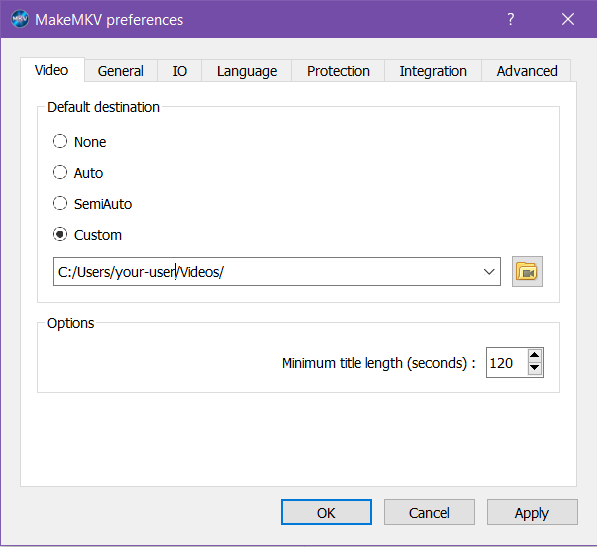
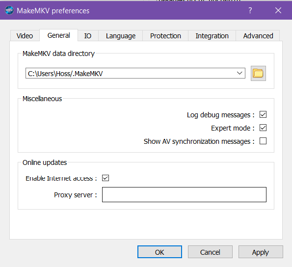

# Ripping Workflow: MakeMKV
I use MakeMKV to create a .mkv containter of the film or show I'm wanting. I just rip the select file and subtitles I'm looking while stripping out the extra files or options on the main file, but if you want the extras on the disc this will work for that too. The instructions below are written for someone using Windows or Fedora UI on a separate machine from the machine running Emby, but that doesn't need to be the case.

## 4K UHD Drive Setup (LibreDrive)
1. **Hardware Verification:** Ensure your drive is on the [supported LibreDrive list](https://forum.makemkv.com/forum/viewtopic.php?f=16&t=19634).
2. **Flashing Firmware:**
   * Follow the guide on the [MakeMKV forum](https://forum.makemkv.com/forum/viewtopic.php?f=16&t=19634).
   * Follow the specific cross-flashing guide for your drive model to enable "LibreDrive" mode.
3. **Software Configuration:**
   * Download/Install MakeMKV (Windows) or compile from source (Fedora). 
   * Windows: Download the .exe from the [MakeMKV website](https://www.makemkv.com/download/Setup_MakeMKV_v1.18.3.exe)
   * Linux: Run the command `flatpak install flathub com.makemkv.MakeMKV`. Make sure to enable Flatpak if you have not done so yet.
   * Register via the current [Beta Key](https://forum.makemkv.com/forum/viewtopic.php?f=5&t=1053).

## Ripping Reminders
* 
* 